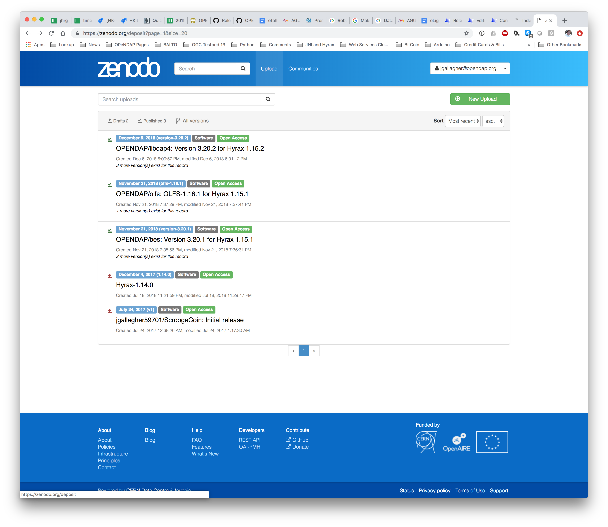

# BES Release process
This pages covers the steps required to release the BES software for
Hyrax.

> **Note**: We now depend on the CI/CD process to build and test the BES software
and the final result is a docker image of the BES.


> **Tip**: If, while working on the release, you find you need to make
changes to the code, and you know the CI build will fail, do so on a
*release branch* that you can merge and discard later. Do not make a
release branch if you don't **need** it, since it complicates making
tags.


> TODO - Add the docker image information (**_bes_core_** etc.)

## Verify the code base

1.  We release using the *master* branch. The code on *master* must have
    passed the CI builds. **This includes the hyrax-docker builds since
    that CI build runs the full server regression tests!**
2.  Make sure that the source code you're using for the following steps
    is up-to-date. (*git pull*)

## Update the Version Numbers

### Version (*for Humans*)

1.  Determine the human version number. This appears to be a somewhat
    subjective process.
2.  Edit each of the *Affected Files* and update the human version
    number.
3.  In the **README.md** file be sure to update the description of how
    to locate the DOI for the release with the new version number.

#### Affected Files
* ***configure.ac*** - In the `configure.ac` file look for, and update, this:
```
AC_INIT(bes, ###.###.###, opendap-tech@opendap.org)
```
* ***ChangeLog***
* ***NEWS***
* ***README.md***
* ***INSTALL***


### Update the libdap version

Determine the libdap version associated with this release by checking
the contents of the file `libdap4-snapshot` The `libdap4-snapshot` file
should contain a single line like this example:

    libdap4-3.20.9-0 2021-12-28T19:23:45+0000

The libdap version for the above example is: `libdap-3.20.9` (The
version is NOT `libdap4-3.20.9`)

#### Update the libdap version in the .travis.yml file

Affected Files
.travis.yml

In the .travis.yml file update the value of *LIBDAP_RPM_VERSION* in the
*env: global:* section so that it contains the complete numerical value
of the libdap version you located in the previous step. Using the
previous example the value would be:

        - LIBDAP_RPM_VERSION=3.20.9-0

### Update the libdap version in the README.md file

#### Affected Files
* README.md

1.  [Get the DOI markdown from Zenodo](https://zenodo.org) by using the
    search bar and searching for the libdap version string that you
    determined at the beginning of this section.
2.  Update the **README.md** file with libdap version and the associated
    DOI link (using the markdown you got from Zenodo).

> **Note**: You will also need this DOI markdown when making the 
GitHub release page for the BES.

See the section on this page titled "*Get the BES DOI from Zenodo*" for
more details about getting the DOI markdown.


### Update the module version numbers for humans

In bes/modules/common, check that the file all-modules.txt is complete
and update as needed. Then run:

- Remove the sentinel files that prevent the version updater from being
  run multiple times in succession without specific intervention:
```
rm -v ../*/version_updated
```

- Now run the version updater:
```
./version_update_modules.sh -v
```
This will update the patch number (x.y.patch) for each of the named
modules.

If a particular module has significant fixes, hand edit the number, in
the Makefile.am.

See below for special info about the HDF4/5 modules (which also applies
to any modules not in the BES GitHub repo).


## [Common Release Tasks](common_release_tasks.md)
Perform the human driven [Common Release Tasks](common_release_tasks.md)
to update the human-readable release files and then come right back here.


## Update the Build Offset

*Setting the build offset correctly will set the build number for the
new release to "0".*

In the file `travis/travis_bes_build_offset.sh` set the value of
`BES_TRAVIS_BUILD_OFFSET` to the number of the last TravisCI build plus
one. The previous commit and push will have triggered a TravisCI build.
Find the build number for the previous commit in [the TravisCI page for
the BES](https://app.travis-ci.com/github/OPENDAP/bes) and use that
build number plus 1.

## Commit Changes

> **!!** You must be working on the *master* branch to get the CD package
    builds to work.

*Be sure that you have completed all the changes to the various
ChangeLog, NEWS, INSTALL, configure.ac,
`travis/travis_bes_build_offset.sh`, and other files before proceeding!*

* Commit and push the BES code. 
* Wait for the CI/CD builds to complete.

## Tag the BES code

The build process automatically tags builds of the master branch. The
Hyrax-version tag is a placeholder for us so we can sort out what code
goes with various Hyrax source releases.

1.  If this is part of a Hyrax Release, then tag this point in the
    master branch with the Hyrax release number
    - `git tag -m "hyrax-`<number>`" -a hyrax-`<numbers>
    - `git push origin hyrax-`<numbers>


> TODO: Is the following 'NB' relevant given that the HDF4/5 code are no longer a git submodules?

> **NB:** *Instead of tagging the HDF4/5 modules, use the saved commit
hashes that git tracks for submodules. This cuts down on the
bookkeeping for releases and removes one source of error.*

## Create the BES release on Github

1.  [Goto the BES project page in
    GitHub](https://github.com/OPENDAP/bes)
2.  Choose the **releases** tab.
3.  On the [Releases page](https://github.com/OPENDAP/bes/releases)
    click the 'Tags' tab.
4.  On the [Tags page](https://github.com/OPENDAP/bes/tags), locate the
    tag (created above) associated with this new release.
5.  Click the ellipses (...) located on the far right side of the
    *version-x.y.z* tag 'frame' for this release and choose *Create
    release*.
    - Enter a *title* for the release
    - Copy the most recent text from the NEWS file into the *describe*
      field
    - Click **Publish release** or **Save draft**.
      - If you have previously edited the release page you can click
        **Update this release**


## Get the BES DOI from Zenodo

Get the Zenodo DOI for the newly created BES release and add it to the
associated GitHub BES release page.

1.  [Goto Zenodo](https://zenodo.org)
2.  Look at the 'upload' page. If there is nothing there (perhaps
    because you are not *jhrg* or whoever set up the connection between
    the BES project and Zenodo) you can use the search bar to search for
    **bes**.

    Since the libdap, BES and OLFS repositories are linked to Zenodo,
    the newly-tagged code is uploaded to Zenodo automatically and a DOI
    is minted for us.
3.  Click on the new version, then click on the DOI tag in the pane on
    the right of the page for the given release.
4.  Copy the DOI as markdown from the window that pops up.
5.  Edit the GitHub release page for the BES release you just created
    and paste the DOI markdown into the top of the description.

**Tip:** *If you are trying to locate the **libdap** releases in Zenodo
you have to search for the string:* `libdap4`

### Images

<figure>

<figcaption>Zenodo.png</figcaption>
</figure>

## Update the online reference documentation

1.  *make gh-docs*

## BES Release Assets 
Internal: 
* The bes_core docker images built by CICD and lodged in DockerHub.

External:
* Source bundle tied to the GitHub release page.
