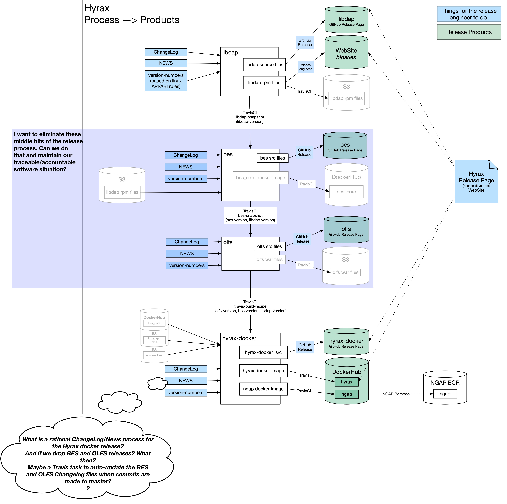

# Making A Hyrax Release
## Overview
Hyrax is made of several software components. Some of these are OPeNDAP software others, like the hyrax-dependencies are code that Hyrax depends on that must be compiled by our process, and not brought in through a package manager. This is, in part, because some of our dependency libraries are customized for our work.

### Release Products
Our release products are:
* **_libdap_** [As source and RPM binaries.](libdap.md)
* **_hyrax_** The Hyrax data server bundled as a docker image.
* **_hyrax:ngap_** The Hyrax NGAP service bundled as docker image.

### Hyrax Components
Hyrax is built from several component projects:
* [hyrax-dependencies](hyrax-dependencies.md) 
  * Version numbers, ChangeLog, and NEWS updated. 
  * GitHub release. 
  * Released assets: **none**.
* [libdap4](libdap.md) 
  * Version numbers, ChangeLog, and NEWS updated. 
  * GitHub release. 
  * Released assets: **Source code tarball & RPM files**. 
* [bes](bes.md)
  * Version numbers, ChangeLog, and NEWS updated. 
  * GitHub release. 
  * Released assets: **none**.
* ~~[olfs](olfs.md)~~ (docs pending) 
  * Version numbers, ChangeLog, and NEWS updated. 
  * GitHub release. 
  * Released assets: **none**.
* hyrax-regression-tests
  * Version numbers, ChangeLog, and NEWS updated.
  * GitHub release. 
  * Released assets: **none**.
* ~~[hyrax-docker](hyrax-docker.md)~~ (docs pending) 
  * Version numbers, ChangeLog, and NEWS updated. 
  * GitHub release. 
  * Released assets: **Hyrax docker images in DockerHub**.

When making a release, for each of these components we need to:
* Update the component's base version number. (For example `1.18.7` --> `1.18.8` or `1.18.7` --> `1.19.0`)
* Update the component's Travis Build Offset and base version numbers.
* A GitHub release should be made for the component, and the associated DOI badges for each component collected from Zenodo for use in the release documentation.

## Regarding DOIs
James said, w.r.t. **libdap**:
> I skimmed over this whole document in the repo and I think it's correct - it's hard to know without going through the process. But, there is one thing I'm sure of. There is (now) a better way to handle the DOI situation. Zenodo recognizes that software has versions and that embedding the DOI for a commit in a file that is part of that commit is a catch-22. So, they now have a DOI that doesn't change but always references the 'newest version.' It takes some hunting to find this, but once you do, this is set. You never need to update this in the README, etc.
>
> I did this, so we can drop this step. See https://zenodo.org/records/14646648. There, on the right you will see:
>>Cite all versions? You can cite all versions by using the DOI 10.5281/zenodo.1013914. This DOI represents all versions, and will always resolve to the latest one. Read more.

>The only thing that needs to be done WRT the DOI is to check that the tagging worked and that Zenodo really did archive a new release of the code.

## Release Diagram
Here's an evolving  picture of the new release proces:

<figure>

<figcaption>Evolving Hyrax Release Process</figcaption>
</figure>
